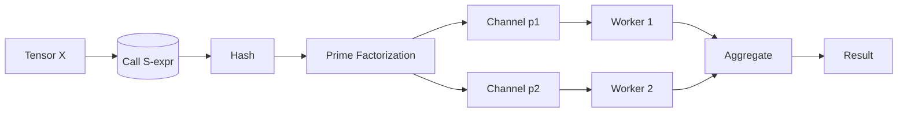
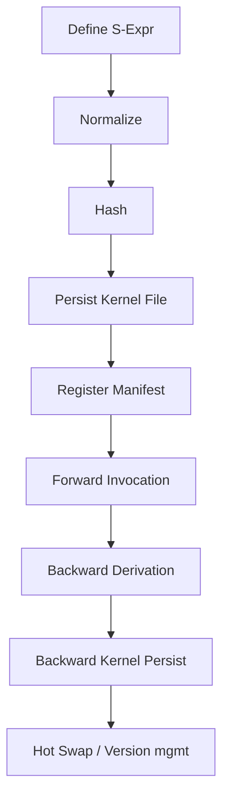

# Activation Functions as Pure Filesystem Kernels in VB9

This note connects the VB9 S-expression ↔ Styx routing model to the idea of activation functions as *pure functions* and shows how they become first-class, hot-swappable, content-addressed kernels in the 9P / filesystem fabric.

## 1. Purity → Referential Transparency → Content Addressability

Given an activation function:

```
σ : ℝ^n → ℝ^m
```

If `σ` is *pure* (no side effects, deterministic), then:

```
∀ x. eval(σ x) = eval(σ x)  ; identical result, enabling:
- Memoization
- Hash-based identity (content hash of S-expression)
- Remote caching & routing reuse
```

We leverage:
1. **S-expression canonical form** → `(lambda (x) (relu x))`
2. **Structural hash** → `hash( sexp ) = Hσ`
3. **Prime routing** → `factorize(Hσ)` gives channel multiset.
4. **Filesystem projection** → `/kernels/σ/<Hσ>.kernel`

Thus the *identity* of an activation is *structurally derived*; two textual definitions that normalize to the same lambda form collapse to the same kernel file.

## 2. Layer Composition as Path Concatenation

A tiny MLP layer in Scheme-like pseudocode:

```scheme
(def-activation relu (lambda (x) (max 0 x)))
(def-activation gelu (lambda (x) (* 0.5 x ( + 1 (tanh (* 0.79788456 (+ x (* 0.044715 (expt x 3)))))))))

(def-layer hidden1 (lambda (x W b) (relu (+ (matmul W x) b))))
(def-layer hidden2 (lambda (x W b) (gelu (+ (matmul W x) b))))
(def-layer output  (lambda (x W b) (softmax (+ (matmul W x) b))))
```

Filesystem layout (conceptual):
```
/net/
  hidden1/
    relu.kernel
    W.param
    b.param
  hidden2/
    gelu.kernel
    W.param
    b.param
  output/
    softmax.kernel
    W.param
    b.param
```

Each activation file contains the *bytecode / IR* of its S-expression.

## 3. Universal Kernel Manifest

```json
{
  "kernel": "relu",
  "hash": "b74c...",
  "sexpr": "(lambda (x) (max 0 x))",
  "inputs": ["tensor"],
  "outputs": ["tensor"],
  "purity": true,
  "version": 1,
  "dependencies": ["max"],
  "bytecode": "/kernels/relu/b74c....kernel"
}
```

## 4. Registration Macro (Pseudocode)

```scheme
(define (normalize-sexpr expr)
  ;; alpha-normalize, constant fold, reorder commutative ops
  (canonicalize expr))

(define (sexpr-hash expr)
  (blake3 (write-to-string (normalize-sexpr expr))))

(define (def-activation name lambda-expr)
  (let* ((norm (normalize-sexpr lambda-expr))
         (h (sexpr-hash norm))
         (path (format "/kernels/~a/~a.kernel" name h)))
    (unless (styx-exists? path)
      (styx-twrite path (lambda->bytecode norm))
      (styx-twrite (format "/kernels/~a/manifest.json" name)
                   (activation->manifest name norm h)))
    path))
```

## 5. Routing an Activation Invocation

Invocation of `(relu X)`:
1. Build sexpr `(relu X)`
2. Hash → `Hcall`
3. Factorize `Hcall = p1 * p2 * ... * pk`
4. Send `(relu X)` over each prime-channel: `/chan/p_i`
5. Worker nodes reconstruct `relu` kernel from `/kernels/relu/<Hσ>.kernel` (cache if present)
6. Execute pure function, return tensor fragments or whole result.



(Parallelization here is optional; prime fanout can serve as *consistent hashing* for load distribution.)

## 6. Backpropagation as Dual Pure Graph

Forward activation: `y = σ(x)`
Backward gradient: `∂L/∂x = (∂σ/∂x) * ∂L/∂y`

We define a dual kernel:
```
σ' : (x, grad_out) -> grad_in
```
Filesystem pairing:
```
/kernels/relu/
  forward/<Hσ>.kernel
  backward/<Hσ'>.kernel
```

Manifest extension:
```json
{
  "kernel": "relu",
  "roles": {
    "forward": "/kernels/relu/forward/b74c.kernel",
    "backward": "/kernels/relu/backward/91aa.kernel"
  }
}
```

Automatic derivation (symbolic differentiation) ensures both forward and backward remain pure. Caching uses their own structural hashes.

## 7. Hot-Swapping an Activation

Replace `relu` with `leaky-relu` without redeploy:
```scheme
(def-activation relu (lambda (x) (if (> x 0) x (* 0.01 x))))
;; New hash => new file; symlink /kernels/relu/current -> <newhash>.kernel
(styx-update-symlink "/kernels/relu/current" newhash)
```
All callers referencing `/kernels/relu/current` pick up the new version; historical runs remain reproducible referencing older content hashes.

## 8. Determinism & Reproducibility
| Aspect | Mechanism |
|--------|-----------|
| Code | Structural hash of canonical S-expression |
| Data | Tensor checkpoint files hashed separately |
| Pipeline | Ordered manifest with hash chain (Merkle) |

## 9. Integrity & Trust
- Use Blake3 or KangarooTwelve for hashing.
- Sign manifest: `/kernels/relu/manifest.sig` (Ed25519) → chain of trust.
- Verify before execution: reject if hash mismatch.

## 10. Example End-to-End Session

```scheme
;; Define two activations
(def-activation relu (lambda (x) (max 0 x)))
(def-activation swish (lambda (x) (/ x (+ 1 (exp (- x))))))

;; Compose layer with symbolic path embedding
(define (dense-layer x W b act)
  (let* ((z (+ (matmul W x) b))
         (path (def-activation act act)) ; ensures kernel exists
         (y (act z)))
    y))
```

## 11. Minimal Bytecode IR Suggestion
| Op | Args | Semantics |
|----|------|-----------|
| `LOAD_INPUT` | idx | Push input tensor |
| `CALL_PRIM` | name | Apply primitive (vectorized) |
| `APPLY_CONST` | scalar | Multiply/scale |
| `BRANCH_POS` | offset | Conditional for piecewise (e.g. ReLU) |
| `RETURN` | - | Output top of stack |

Pure activations map to short linear sequences, enabling JIT or interpretation.

## 12. Optimization Opportunities
| Optimization | Description |
|--------------|-------------|
| Hash DAG Fusion | Combine adjacent elementwise kernels before emission |
| Sparse Mask Reuse | ReLU backward uses forward mask; store bitmask file |
| Ahead-of-Time Gradient Pairing | Emit forward/backward concurrently to reduce latency |

## 13. Observability Hooks
Emit structured events under `/kernels/relu/events.log`:
```
activation.invoke hash=b74c latency_us=23 bytes_in=4096
activation.backward hash=91aa latency_us=31
```

## 14. Failure Modes & Safeguards
| Failure | Mitigation |
|---------|------------|
| Non-pure side effects in activation | Static analyzer rejects disallowed forms (I/O, mutation) |
| Hash collision (theoretical) | Include length + domain separation tag in preimage |
| Version drift | Retain immutable hash path; only update `current` symlink |
| Gradient mismatch | Auto-check finite differences for sample batches |

## 15. Cognitive Flow (Activation Lifecyle)


## 16. Prime Channel Strategy (Optional)
- Use first k primes to shard large tensor across workers.
- Each prime channel carries a slice; recombine via deterministic order.
- Channel mapping stable: `slice_index = prime_rank mod num_slices`.

## 17. Interop With VB9 Runtime
| Runtime Function | Activation Tie-In |
|------------------|-------------------|
| `backpropagate-glyph` | Mirrors forward/backward dual of activations |
| `kernel->bytecode` | Emits activation IR |
| `styx-twrite` | Stores activation kernels |
| `styx-recv` | Activation invocation request channel |

## 18. Next Steps
1. Implement `normalize-sexpr` & hashing.
2. Build static purity validator (no `set!`, no I/O forms).
3. Create forward/backward symbolic differentiator.
4. Bytecode interpreter for elementwise activations.
5. Observability events & `current` symlink updater.

---
Need concrete code for differentiator, purity checker, or bytecode interpreter? Ask and we can scaffold them next.
