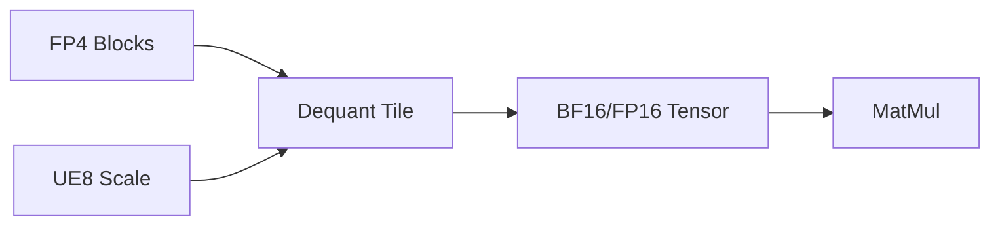
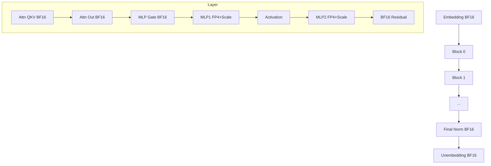

# Precision / Quantization Manifest for gpt-oss-20b

This manifest formalizes a *hybrid mixed-precision* layout combining BF16 activations/critical weights with FP4 + UE8 (per-block quantization) for large MLP matrices.

## 1. Raw Pattern Mapping (User Supplied)
```json
{
  "embedding.weight": "BF16",
  "block.[i].attn.norm.scale": "BF16",
  "block.[i].attn.qkv.weight": "BF16",
  "block.[i].attn.qkv.bias": "BF16",
  "block.[i].attn.sinks": "BF16",
  "block.[i].attn.out.weight": "BF16",
  "block.[i].attn.out.bias": "BF16",
  "block.[i].mlp.norm.scale": "BF16",
  "block.[i].mlp.gate.weight": "BF16",
  "block.[i].mlp.gate.bias": "BF16",
  "block.[i].mlp.mlp1_weight.blocks": "FP4",
  "block.[i].mlp.mlp1_weight.scales": "UE8",
  "block.[i].mlp.mlp1_bias": "BF16",
  "block.[i].mlp.mlp2_weight.blocks": "FP4",
  "block.[i].mlp.mlp2_weight.scales": "UE8",
  "block.[i].mlp.mlp2_bias": "BF16",
  "norm.scale": "BF16",
  "unembedding.weight": "BF16"
}
```
`[i]` iterates over transformer layers `0..N-1`.

## 2. Semantics of Formats
| Tag | Meaning | Bits | Notes |
|-----|---------|------|-------|
| BF16 | Brain float 16 (1 sign, 8 exp, 7 mantissa) | 16 | Stable for accumulations, scaling, layer norms |
| FP4 | 4-bit float (implementation-defined, e.g. (1 sign, 2 exp, 1 mantissa) or custom) | 4 | Stored in packed blocks; dequantized on-the-fly |
| UE8 | Unsigned exponent/int8 scale factors | 8 | Per-block scaling (log or linear) to reconstruct FP4 block |

Pair `(FP4 blocks + UE8 scales)` encodes large linear layers: weight matrix chunked into tiles; each tile: FP4 payload + scale.

## 3. Rationale
- Keep **attention projections** (QKV, output) in BF16 to preserve numerical stability in softmax and context mixing.
- Quantize **feed-forward (MLP) expansion / contraction** matrices to FP4 for large memory savings; they dominate parameter count.
- Retain **bias, norm scale, embedding, unembedding** in BF16 for precision-critical gradients and to reduce quantization error accumulation.

## 4. Expanded Pattern (Regex-Friendly)
```
^embedding\.weight$                             -> BF16
^block\.(\d+)\.attn\.norm\.scale$             -> BF16
^block\.(\d+)\.attn\.qkv\.(weight|bias)$      -> BF16
^block\.(\d+)\.attn\.sinks$                   -> BF16
^block\.(\d+)\.attn\.out\.(weight|bias)$      -> BF16
^block\.(\d+)\.mlp\.norm\.scale$              -> BF16
^block\.(\d+)\.mlp\.gate\.(weight|bias)$      -> BF16
^block\.(\d+)\.mlp\.mlp1_weight\.blocks$      -> FP4
^block\.(\d+)\.mlp\.mlp1_weight\.scales$      -> UE8
^block\.(\d+)\.mlp\.mlp1_bias$                -> BF16
^block\.(\d+)\.mlp\.mlp2_weight\.blocks$      -> FP4
^block\.(\d+)\.mlp\.mlp2_weight\.scales$      -> UE8
^block\.(\d+)\.mlp\.mlp2_bias$                -> BF16
^norm\.scale$                                   -> BF16
^unembedding\.weight$                           -> BF16
```

## 5. Memory Impact (Illustrative, Not Exact)
Let:
- Hidden size H
- MLP expansion size E (often 4H or gated variant)
- Blocks: weight1 (H→E), weight2 (E→H).

Approx baseline BF16 cost (ignoring biases): `2 * H * E * 2 bytes`.
FP4 + scales: each 4-bit weight = 0.5 byte. For block size B with one 8-bit scale per block of K elements:
```
Weight bytes ≈ 0.5 * H * E + (H * E / K) * 1
Compression ratio ≈ (2 * H * E) / (0.5 * H * E + H * E / K)
                 = 2 / (0.5 + 1/K)
For K=128 -> 2 / (0.5 + 0.0078125) ≈ 3.85×
```

## 6. Dequantization Path

Dequantization ideally fuses with GEMM epilogue (kernel-level) to minimize memory traffic.

## 7. Execution Pseudocode (Load + Dispatch)
```python
PRECISION_MAP = {
    "BF16": torch.bfloat16,
}

def classify_param(name):
    if ".mlp1_weight.blocks" in name or ".mlp2_weight.blocks" in name:
        return "FP4_BLOCKS"
    if ".mlp1_weight.scales" in name or ".mlp2_weight.scales" in name:
        return "UE8_SCALES"
    return "BF16"

class HybridLinear(torch.nn.Module):
    def __init__(self, weight_blocks, scales, in_f, out_f, block_size=128):
        super().__init__()
        self.weight_blocks = weight_blocks  # packed int8 tensor holding two FP4 per byte
        self.scales = scales                # uint8 scales per block
        self.in_f = in_f; self.out_f = out_f; self.block_size = block_size

    def forward(self, x):
        # dequant + matmul fused (conceptual)
        W = dequant_fp4(self.weight_blocks, self.scales, self.out_f, self.in_f, self.block_size)
        return x @ W.T
```
`dequant_fp4` would map nibble pairs + scale to BF16/FP16 matrix (or stream them into a custom matmul kernel without materializing full W).

## 8. Integration Strategy Options
| Strategy | Description | Pros | Cons |
|----------|-------------|------|------|
| Eager Dequant | Convert FP4→BF16 once at load | Simple | Higher RAM peak |
| On-the-fly Fused | Custom kernel consumes FP4 + scales | Lowest memory | Engineering overhead |
| Just-in-Time Tile Cache | Cache hottest tiles expanded | Balanced | Cache complexity |

## 9. Error / Drift Mitigation
| Risk | Mitigation |
|------|-----------|
| Scale overflow | Clamp + track saturation counters |
| FP4 underflow | Dynamic scale rebasing per tile |
| Mismatched shapes | Validate shape metadata before load |

## 10. Validation Checklist
- [ ] All BF16 tensors loaded with correct dtype
- [ ] FP4 blocks parity check (nibbles count even)
- [ ] Scales length * block_size == weight_elements (or matches design spec)
- [ ] Norm scales finite (no NaN/Inf)

## 11. JSON Manifest Proposal
```json
{
  "version": 1,
  "formats": {
    "BF16": {"bits": 16, "role": ["norm", "embed", "attn", "bias"]},
    "FP4":  {"bits": 4,  "role": ["mlp_weight"]},
    "UE8":  {"bits": 8,  "role": ["mlp_scale"]}
  },
  "patterns": [
    {"regex": "^embedding\\.weight$", "format": "BF16"},
    {"regex": "^block\\\\.(\\\\d+)\\\.attn\\.qkv\\.(weight|bias)$", "format": "BF16"},
    {"regex": "^block\\\\.(\\\\d+)\\\.mlp\\.mlp1_weight\\.blocks$", "format": "FP4"},
    {"regex": "^block\\\\.(\\\\d+)\\\.mlp\\.mlp1_weight\\.scales$", "format": "UE8"},
    {"regex": "^block\\\\.(\\\\d+)\\\.mlp\\.mlp2_weight\\.blocks$", "format": "FP4"},
    {"regex": "^block\\\\.(\\\\d+)\\\.mlp\\.mlp2_weight\\.scales$", "format": "UE8"},
    {"regex": "^unembedding\\.weight$", "format": "BF16"}
  ],
  "fused_dequant": true,
  "block_size": 128,
  "scale_encoding": "linear_uint8"
}
```

## 12. Optional: Runtime Decision Function
```python
def needs_fp4(name):
    return name.endswith(("mlp1_weight.blocks", "mlp2_weight.blocks"))

def is_scale(name):
    return name.endswith(("mlp1_weight.scales", "mlp2_weight.scales"))
```

## 13. Mermaid Overview of Hybrid Precision


## 14. Suggested Next Steps
1. Implement `dequant_fp4` prototype (Python + vectorized lookup table).
2. Add manifest loader that applies regex mapping before weight load.
3. Provide calibration script to measure perplexity delta vs full BF16.
4. Optionally emit telemetry: per-layer max |error| after dequant.

---
If you want a concrete Python module + test harness for FP4 decode next, say so and it can be added.
