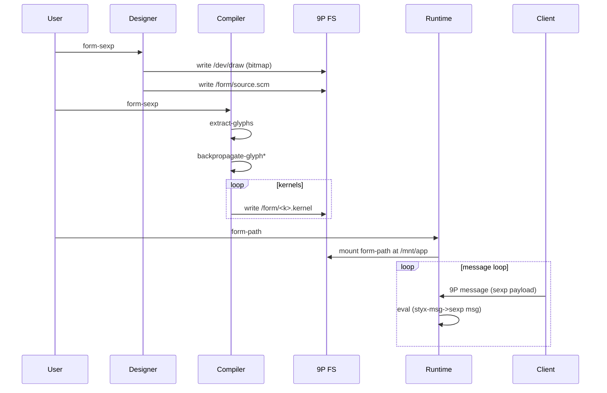
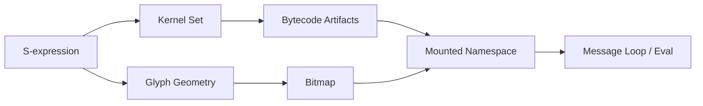
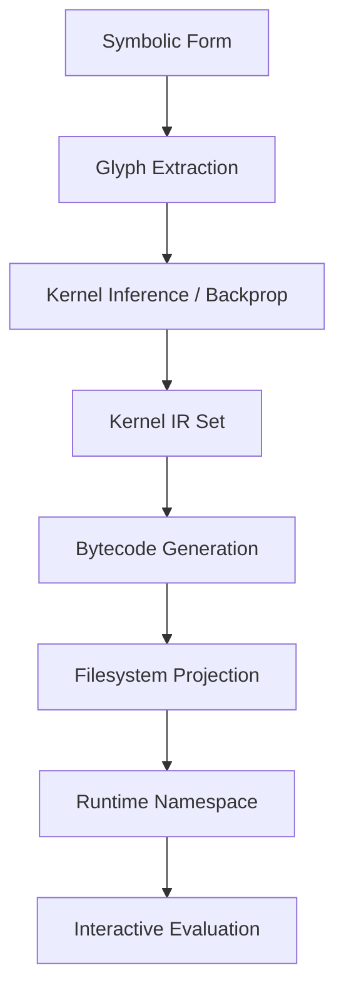

# vb9-ide Architecture (Designer · Compiler · Runtime)

This document analyzes and extends the expressive environment defined by the form:

```scheme
(define-vb9-ide
  (designer (lambda (form-sexp)
              (let ((glyph-pattern (sexp->bitmap form-sexp)))
                (styx-twrite "/dev/draw" glyph-pattern)
                (styx-twrite "/form/source.scm" form-sexp))))
  (compiler (lambda (form-sexp)
              (let ((kernels (map backpropagate-glyph (extract-glyphs form-sexp))))
                (for-each (lambda (k)
                            (styx-twrite (format "/form/~a.kernel" (kernel-name k))
                                          (kernel->bytecode k)))
                          kernels))))
  (runtime  (lambda (form-path)
              (styx-mount form-path "/mnt/app")
              (let loop ()
                (let ((msg (styx-recv)))
                  (eval (styx-msg->sexp msg))
                  (loop))))))
```

## 1. Conceptual Overview
`vb9-ide` is a minimalist, Plan 9 / 9P-inspired reflective development loop where:
- **Designer**: Turns an S-expression (form) into a *glyph bitmap* and persists both visual and source artifacts.
- **Compiler**: Decomposes the form into *glyph kernels*, performs reverse shaping (`backpropagate-glyph`), and emits per-kernel bytecode artifacts under a virtual filesystem namespace.
- **Runtime**: Mounts the compiled form as a live 9P service and executes an infinite S-expression message loop.

The environment merges *symbolic code*, *visual structure*, and *filesystem-addressable artifacts* with a unifying protocol (Styx / 9P semantics): every transformation becomes a file operation.

## 2. Component Breakdown
| Component  | Responsibility | Inputs | Outputs | Side Effects |
|-----------|----------------|--------|---------|--------------|
| Designer  | Visualizes + persists source | `form-sexp` | `glyph-pattern` | Writes `/dev/draw`, `/form/source.scm` |
| Compiler  | Structural decomposition + code gen | `form-sexp` | Bytecode per kernel | Writes `/form/*.kernel` |
| Runtime   | Dynamic evaluation service | `form-path` | Execution results | Mounts FS, evaluates messages |

## 3. Data / Artifact Model
| Artifact | Origin | Format | Purpose |
|----------|--------|--------|---------|
| `/dev/draw` | Designer | Bitmap (raster) | Render target for current form glyph |
| `/form/source.scm` | Designer | S-expression text | Source of the active form |
| `/form/*.kernel` | Compiler | Bytecode blobs | Individually addressable compiled kernels |
| `/mnt/app` | Runtime mount | 9P namespace | Live application surface |

## 4. Mermaid Component Diagram
```mermaid
graph TD
  U[User Edits Form] --> D[Designer]
  D -->|sexp->bitmap| R1[/dev/draw]
  D -->|persist source| R2[/form/source.scm]
  U --> C[Compiler]
  C -->|extract-glyphs| G[Glyph Kernels]
  G --> BP[backpropagate-glyph]
  BP --> BC[kernel->bytecode]
  BC --> R3[/form/*.kernel]
  R3 --> RT[Runtime]
  R2 --> RT
  RT -->|mount| NS[/mnt/app]
  Client[9P Client] --> NS
  Client -->|messages| RT
```

## 5. Execution Sequence (User → Live System)

`*backpropagate-glyph` suggests a differentiable or structural inversion pass mapping rendered glyph geometry back to a canonical kernel representation.

## 6. Cognitive Flow Layers
| Layer | Role | Representative Functions |
|-------|------|--------------------------|
| Symbolic | S-expression AST | `extract-glyphs`, `kernel-name` |
| Geometric | Glyph rasterization | `sexp->bitmap`, `backpropagate-glyph` |
| Compilation | Kernel lowering | `kernel->bytecode` |
| Persistence | File emission | `styx-twrite`, `styx-mount` |
| Reactive Runtime | Message evaluation | `styx-recv`, `eval` |



## 7. Scheme Manifest (Structured Spec)
```json
{
  "constructs": {
    "define-vb9-ide": "(define-vb9-ide <designer> <compiler> <runtime>)",
    "designer": "(lambda (form-sexp) => writes bitmap + source)",
    "compiler": "(lambda (form-sexp) => emits kernel bytecode files)",
    "runtime": "(lambda (form-path) => mounts + eval loop)"
  },
  "pipelines": {
    "design": ["sexp->bitmap", "styx-twrite /dev/draw", "styx-twrite /form/source.scm"],
    "compile": ["extract-glyphs", "backpropagate-glyph", "kernel->bytecode", "styx-twrite /form/<k>.kernel"],
    "run": ["styx-mount", "styx-recv", "styx-msg->sexp", "eval"]
  },
  "artifacts": {
    "/dev/draw": "bitmap/current form raster",
    "/form/source.scm": "canonical source form",
    "/form/<name>.kernel": "compiled kernel bytecode",
    "/mnt/app": "runtime mount namespace"
  },
  "extensibility": {
    "kernels": "Add new glyph decomposition passes",
    "bytecode": "Target alternate VM encodings",
    "transport": "Swap 9P for alternative IPC if needed"
  }
}
```

## 8. Inferred / Missing Primitives
| Symbol | Purpose | Proposed Contract |
|--------|---------|-------------------|
| `sexp->bitmap` | Rasterize semantic form | `(sexp) -> bitmap[int[row][col]]` |
| `extract-glyphs` | Walk AST to glyph units | `(sexp) -> list[glyph]` |
| `backpropagate-glyph` | Recover kernel from visual form | `(glyph) -> kernel` |
| `kernel->bytecode` | Lower kernel IR | `(kernel) -> bytes` |
| `styx-twrite` | Transactional write to 9P file | `(path, data) -> ok|err` |
| `styx-mount` | Attach remote namespace | `(src, mountpoint) -> ok|err` |
| `styx-recv` | Receive next protocol message | `() -> msg` |
| `styx-msg->sexp` | Decode message payload | `(msg) -> sexp` |

## 9. Error Handling & Robustness Enhancements
| Area | Issue | Mitigation |
|------|-------|-----------|
| Designer | Partial write | Use temp path + atomic rename |
| Compiler | Duplicate kernel names | Namespacing + hash suffix |
| Runtime | Infinite eval risk | Introduce sandbox & time limits |
| Message Loop | Blocking `styx-recv` | Use selectable / concurrency primitive |
| Bytecode Integrity | Corruption | Include manifest with Blake3 digest |

### Suggested Guards (Pseudo-Scheme)
```scheme
(define (safe-styx-twrite path data)
  (let ((tmp (string-append path ".tmp")))
    (styx-twrite tmp data)
    (styx-rename tmp path)))

(define (compile-form form)
  (for-each
    (lambda (k)
      (let* ((name (kernel-name k))
             (bytes (kernel->bytecode k))
             (path (format "/form/~a.kernel" name)))
        (safe-styx-twrite path bytes)))
    (unique-kernels (map backpropagate-glyph (extract-glyphs form))))
```

## 10. Caching & Incremental Build Strategy
- Hash each kernel IR before emission: skip unchanged.
- Maintain `/form/manifest.json` with: `[ {"kernel":"name","hash":"...","bytecode":"/form/name.kernel"} ]`.
- Designer writes a content hash of `form-sexp` into extended attribute for quick change detection.

## 11. Security / Sandboxing Considerations
| Vector | Risk | Strategy |
|--------|------|----------|
| `eval` arbitrary | Code injection | Restrict environment, whitelist forms |
| 9P exposure | Unauthorized mutation | Separate RO vs RW mounts |
| Bytecode execution | Host escape | Run in capability-limited VM |

## 12. Observability
Emit structured trace events into `/form/events.log`:
```
T(design.start, form-hash)
T(design.complete, bitmap-bytes)
T(compile.kernel, name, hash, size)
T(runtime.msg, op, latency-us)
```

## 13. Performance Notes
| Hot Path | Consideration | Optimization |
|----------|---------------|-------------|
| Rasterization | Large glyph graphs | Memoize glyph subtrees |
| Kernel backprop | Potentially expensive | Parallel map over glyph list |
| Bytecode emission | Small writes | Batch into packfile with index |
| Message loop eval | Repeated parsing | Precompile stable forms |

## 14. Extensibility Roadmap
1. **Hot Reload**: Runtime watches `/form/source.scm`, triggers recompile + live swap.
2. **Deterministic Replay**: Capture message log; re-simulate state.
3. **Visual Diffing**: Compare successive `glyph-pattern`s via XOR & highlight changed pixels.
4. **Multi-View Targets**: Additional raster sinks `/dev/draw-small`, `/dev/draw-hires`.
5. **Introspection API**: Expose `/mnt/app/introspect` returning current kernel graph.

## 15. Cognitive Flow (Reasoning Layers)


## 16. Sample End-to-End Pseudocode Driver
```scheme
(define (rebuild! form-sexp)
  (designer form-sexp)
  (compiler form-sexp)
  'ok)

(define (start-runtime form-path)
  (runtime form-path))

;; Usage
(let ((form '(widget (stroke 90 1) (dot))))
  (rebuild! form)
  (start-runtime "/form"))
```

## 17. Manifest Example
```json
{
  "formHash": "b3f6...",
  "kernels": [
    {"name": "dot-0", "hash": "a1c2...", "bytecode": "/form/dot-0.kernel"},
    {"name": "stroke-90x1", "hash": "9ff0...", "bytecode": "/form/stroke-90x1.kernel"}
  ],
  "bitmap": {"path": "/dev/draw", "width": 16, "height": 24},
  "generated": "2025-08-09T00:00:00Z"
}
```

## 18. Validation Heuristics
| Check | Predicate |
|-------|-----------|
| Kernel Closure | All referenced kernels have emitted bytecode |
| Bitmap Non-Empty | `(> (ink-pixels bitmap) 0)` |
| Bytecode Size Bounds | `0 < size <= MAX_KERNEL_BYTES` |
| Hash Consistency | Recorded hash matches recomputed |

## 19. Potential Integration with Glyph Logic (Earlier Layer)
If adopting earlier `kernel/1` & `render/2` logic:
- `backpropagate-glyph` ≈ inverse of `render/2` for limited kernel classes.
- Maintain dual mapping: symbolic kernels <-> raster glyph patterns.
- Use associative composition to collapse deep composites before bytecode emission.

## 20. Open Questions
| Topic | Question |
|-------|----------|
| Backprop Algorithm | Gradient-based vs structural pattern match? |
| Bytecode VM | Stack, register, or graph IR? |
| Hot Reload Semantics | In-flight messages during swap? |
| Security Model | Capability scoping per message? |

---
**Next Steps (Suggested):**
1. Implement manifest writer & integrity hashes.
2. Add safe atomic write wrapper (`safe-styx-twrite`).
3. Prototype `sexp->bitmap` and `backpropagate-glyph` minimal versions.
4. Introduce sandboxed evaluator with whitelisted forms.

Let me know if you’d like concrete code stubs for any primitive (e.g., bitmap ops, hashing, or a mock 9P transport).
